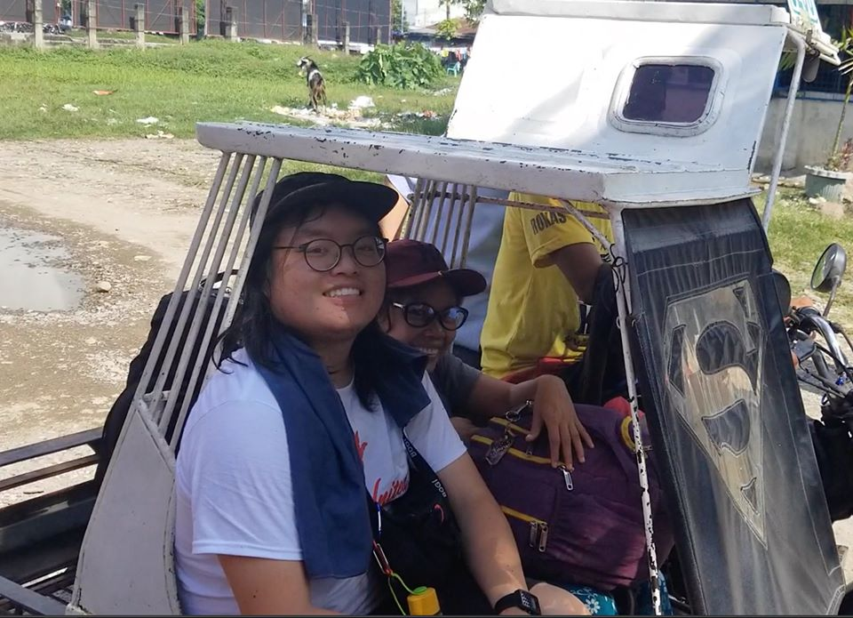

import Separator from "../../../../../src/components/separator"

  A news article can be found{" "}
  <a href="https://newsinfo.inquirer.net/1323087/negros-based-activist-killed-in-bacolod-rights-group-says">
    here
  </a>
  .

My friend and comrade/kasama Zara Alvarez was assassinated earlier today in her home in Bacolod City, Negros Occidental, Philippines.

She was a human rights defender as a leading member of [Karapatan Negros Island](https://www.facebook.com/KarapatanNegrosIsland/). She acted as paralegal for peasant farmers constantly under attack by the fascist state of the landlords and compradors in the Philippines. She organized health missions to remote villages, brought food aid to those in need, and more. She was a well-known and well-loved activist.

Zara was one of my first guides when I arrived in Negros in July 2019. She helped me get on my first jeepney! She taught me about the struggles of the people for land, water, and peace.

For first leg of my journey, Zara took me to a meeting she already had scheduled with six peasant women and their children, whose husbands had all been mass-arrested on fake charges. She interviewed them and gave them advice.

The day I left Negros Island, she wasn't able to see me off because she was called away on an emergency: the Philippine Army had entered a peasant village in the north of the island and was forcing them to sign "surrender" papers. She had to be there as a legal observer and advocate.

<Separator />

In the last week, two activists whose names appeared on the Philippine government's [2018 hit list](https://rappler.com/nation/philippines-terrorist-tag-communist-rebels) have been murdered.

On Negros island alone, dozens and dozens of farmers, environmental activists, lawyers, and human rights defenders have been killed in the last few years.

If you ask me, Duterte's [Memorandum Order 32](https://www.officialgazette.gov.ph/downloads/2018/11nov/20181122-MO-32-RRD.pdf) to send hundreds and hundreds of soldiers to act with impunity is to blame. Negros island is one of the most heavily militarized, under what human rights group [Karapatan Alliance Philippines](https://www.karapatan.org/) (esp Karapatan Negros) calls "de facto martial law".

Zara knew how dangerous this work was. She did it anyway.

That's how I will remember Zara – as a tireless defender of the people. She was a hero and should be remembered as one.
