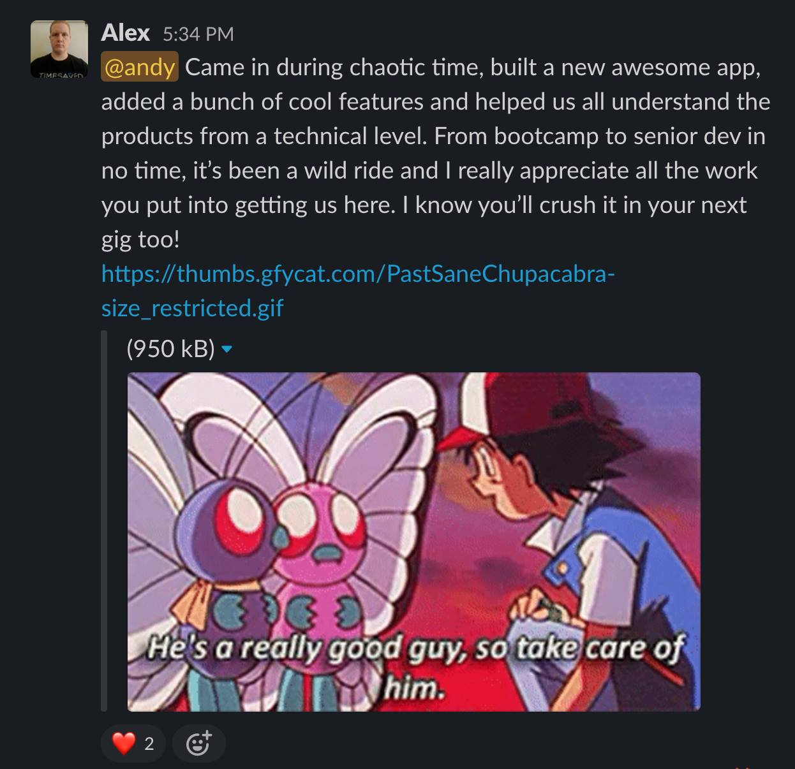

I recently switched jobs from the startup where I was employed as a software developer for about a year and a half.

My coworkers sent thoughtful goodbye messages, but I liked Alex's the best:

I never felt under-appreciated at that job, but it's nice seeing it put into one place like this.

Here's an overview of my contributions to that company:

- completely rebuilt the mobile application from the ground up
  - _React Native+Expo, Apollo GraphQL, Socket.IO_
- automated whitelabelled deployment and builds for mobile apps
  - _Expo and some Bash scripts, and eventually Github Actions_
- moved into the back end, introduced automated unit and integration testing
  - _Node, Express, Mongo, Jest, Github Actions for CI_
- designed and implemented a timesheet approval feature, a customizable-per-tenant user onboarding flow, and a ton more features
  - _React, React Native, GraphQL and mostly-REST APIs on that Node/Express/Mongo back end_
- picked up devops skills and helped manage the software release cycle
  - _Azure, Docker, Github Actions_
- promoted to Senior Software Developer after a year, conducted code reviews and mentored more junior colleagues

I'm a little sad to be leaving behind the relationships I'd built there, but the team is in great shape even without me.

Now, onto the next chapter!
