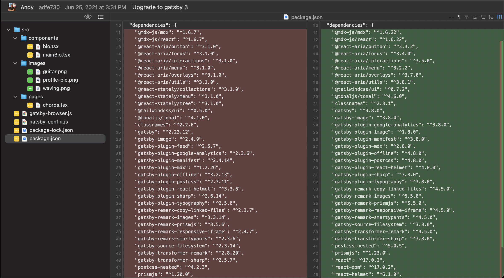
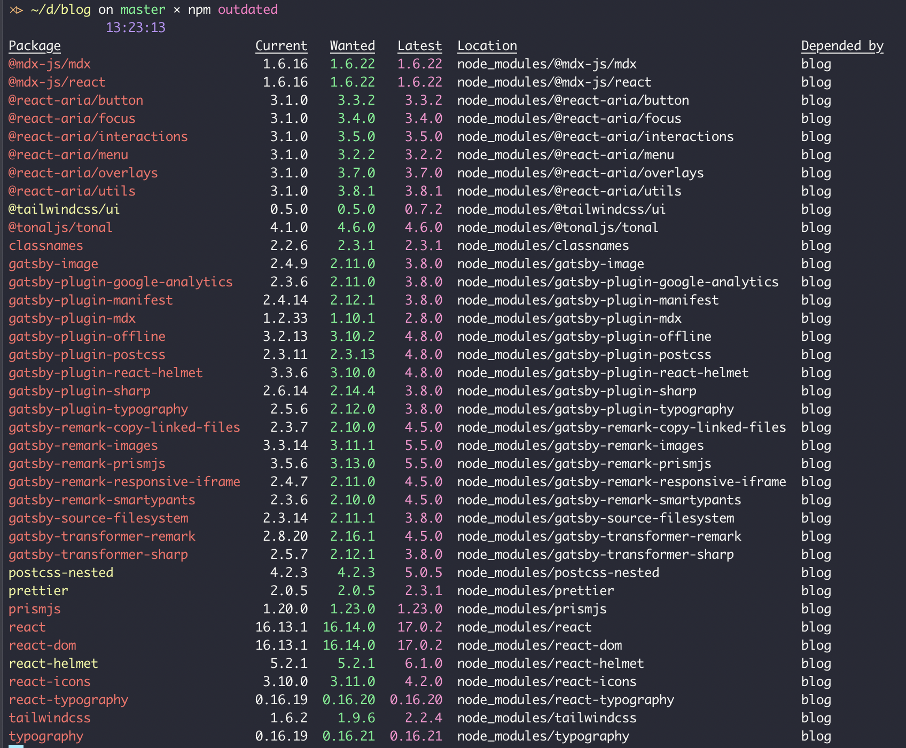
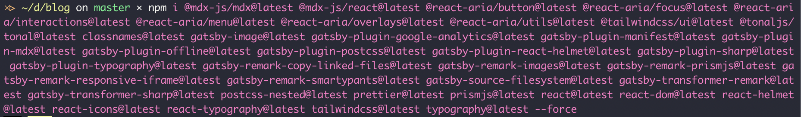

import Separator from "../../../../../src/components/separator"

The cool thing about personal projects, especially ones where nobody else will ever touch the code, is that I am at perfect liberty to do whatever the hell I want. And nobody can stop me.

Fair warning, this post probably won't prove to be technically useful to anyone, but it might provide moral support or encouragement for others considering doing the same thing I did. It's also going to be wordy, because I'm going to be self-indulgent and also I won't edit this.

## Bad diff

This blog is a [Gatsby](https://gatsbyjs.org/) project. The source is on [Github](https://github.com/a8t/blog). It was originally generated with the [blog starter](https://www.gatsbyjs.com/starters/gatsbyjs/gatsby-starter-blog/) last year, but that was back in a previous major version of Gatsby (v2.x -> v3.x).

Today, after about a year of without touching the project, I decided to **upgrade every single dependency to the latest version**, if possible. (Spoilter: it was!)

Here's my [package.json diff](https://github.com/a8t/blog/commit/adfe730a608f796b10df116d951762a104ddf29e?branch=adfe730a608f796b10df116d951762a104ddf29e&diff=unified):

If someone tried to submit a PR with a change this in a codebase I shared with them, I would reject it immediately and schedule a one-on-one with them to figure out what was going through their head.

But, y'know. Side project, static site generator... ehh! 🤠

## This again?

I've had a bad time trying to upgrade Gatsby projects before, so I was a bit nervous walking into this one.

A few things were different this time around, though. That [first project](https://github.com/a8t/kamalayan) was originally written in a pre-1.0 version of Gatsby. I didn't upgrade it when 1.0 rolled around, and so recently when I tried upgrading to 2.x just to see what would happen, I was slapped with an impenetrable forest of bugs. Plus, that first codebase was written a few years ago, before I learned what the hell I was doing.

I was concerned that my experience would be similar this time. But then I read through the [v2 -> v3 migration document](https://www.gatsbyjs.com/docs/reference/release-notes/migrating-from-v2-to-v3/) and realized that I'd have to make only one type of change, which was to the way that images are queried and rendered. More on that later.

So with that good news in mind, I jumped right into updating packages.

## ...All of them?

You might be wondering why I decided to upgrade _every single dependency_ in this project. I have to be honest with you. It's because I'm lazy.

I ran `npm outdated`. Everything was outdated.

Okay, awesome 😕. My first step from here was to figure out which dependencies I could completely rip out, which turned out to be about a fifth of them (11/50... 🥲). Maybe I had pulled them in for some experiment and forgotten to remove them. In any case, my goal was to cut down on complications for the next (much more evil) step.

I copied all of the remaining outdated packages into my editor (I use VS Code after failing to learn Vim on several occasions). I added `@latest` to each of them... and I used that to update them all at once.

In general, I gotta say... don't do this. It's usually a waste of time. There's almost no way to get yourself out of a mess like this once things start conflicting, because **you can't be sure which updated package broke what**.

Buuuuuut, again, if it's a side project and you're itching to waste your own time like me, go for it!

So at this point, the codebase was predictably totally broken. But I had faith, and so I pressed on. A boat against the current 😉.

## Breaking changes

The Gatsby v2 -> v3 migration doc politely lists all breaking changes.

If you've read this far, I think it'd be safe to assume you know what that means, but just in case: suppose that some code I wrote last year uses version v4.2.0 of a third-party package. But since then, the package has gone through a lot of changes. By the time I upgrade to the current version v6.9.0, the code that I wrote last year might be completely invalid!

When this happens, _good_ package developers include changelogs at minimum, and full migration guides if they're awesome. The Gatsby team appears to be awesome.

Ideally, they wouldn't introduce any changes that break other people's code at all. Sometimes there's a great reason to do so, and in those cases they list exactly what changes are necessary.

## Image packages

For me, the only change that was necessary was to change how images work in the blog. I had to move from [`gatsby-image`](https://www.gatsbyjs.com/plugins/gatsby-image/) to [`gatsby-image-plugin`](https://www.gatsbyjs.com/plugins/gatsby-plugin-image). The awesome thing about this is that the breaking change that was introduced was meant to _simplify_ the way the package is meant to be used (its API).

Both of these packages have the same goal, which is to add some fancy image preprocessing to optimize user experience. It does stuff like compressing or even generating a traced SVG version of images, so that these can be sent over the wire as a meaningful placeholder for images. Then, after other content has loaded, they replace the placeholders with the actual image. It's a pretty slick UX.

Since this is a core feature of Gatsby, the breaking change actually came with its [own migration guide](https://www.gatsbyjs.com/docs/reference/release-notes/image-migration-guide/) which was handy.

I worked through that migration guide and... I don't mean to be anti-climactic, but the site just worked after that!

## Summary

Managing dependencies is part of every developer's work, and it's not usually very fun. But the ease of this process actually makes me feel more positive about going back and upgrading other projects.

Overall, I'm surprised that this actually worked the way I did it. I've spent the past few days tweaking the site and kind of dreading this eventual upgrade the whole time. I didn't expect that it would take under an hour.

I think that big kudos are due to the Gatsby team for the great migration notes, as well as for the well-designed APIs.
