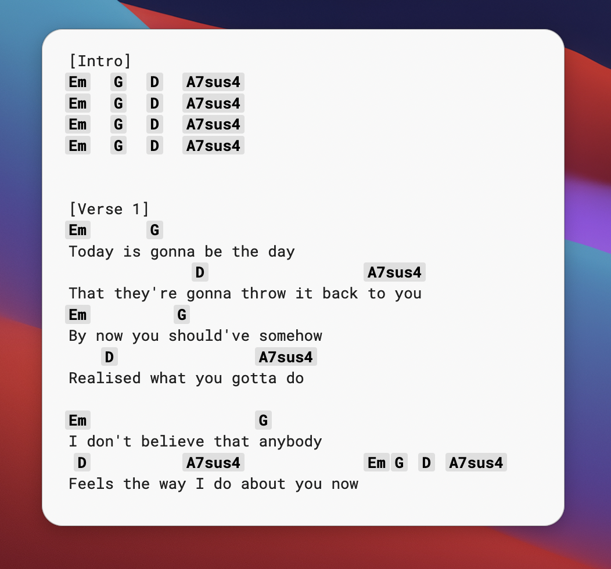
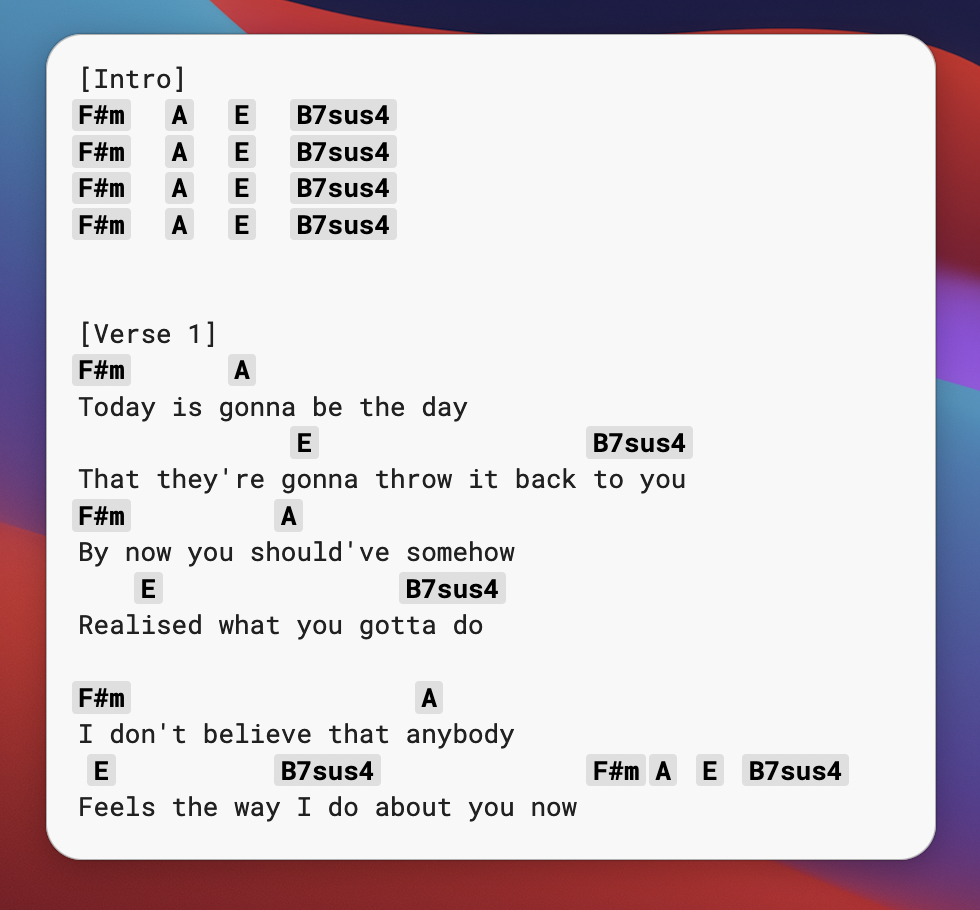
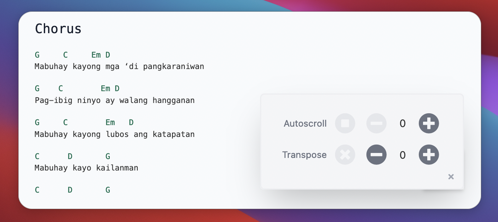

#### Table of Contents {#contents}

1. [Introduction](#intro)
1. [Chord charts? Transposition?](#chord-charts)
1. [The code](#code)
   1. [Context](#transposecontext)
   1. [Consumers](#consumers)
   1. [Markdown](#markdown)

## Introduction {#intro}

I have a [section of this website](/chords) dedicated to displaying chord charts of songs I like, along with a feature to transpose the chord charts. This post will explain how I used React Contexts and [TonalJS](https://github.com/tonaljs/tonal) to make this work.

I built this site using Gatsby, a static site generator for React. The code for the chord transposition is [available on my github](https://github.com/a8t/blog/blob/master/src/components/chords.tsx). (There is also an autoscroll feature which I won't cover here, but it's [not that complex](https://github.com/a8t/blog/blob/master/src/components/AutoscrollControl.tsx).)

If you already know what chord charts and transposition are, you can skip to the [Show Me The Code](#code) section below.

## Chord charts? Transposition?

Chord charts are a simple way for musicians to convey the progression of chords in a song. They're primarily used by guitarists, as far as I'm aware, but any musician could read them. Usually, the chords are arranged alongside lyrics, to provide a bit of rhythmic information as well.

[](https://tabs.ultimate-guitar.com/tab/oasis/wonderwall-chords-27596)

That's the chord chart for the first bit of Wonderwall by Oasis. As you can see, there are repeating patterns (Em → G → D → A). Music usually sticks to one or two _keys_, which are groupings of notes that sound pleasant together.

But what if the key that the song is originally in is too high for you to sing? That's where **transposition** comes in. To transpose music means to change the key in which it is based, or in other words to raise or lower every note in the music by the same interval (pitch distance).

The most common way to describe those changes is in semitones. A semitone is, more or less, one twelfth of an octave.

Here's the chord chart for that same song, transposed up two semitones. Em → F#m, G → A, D → E, and A7sus4 → B7sus4.

[](https://tabs.ultimate-guitar.com/tab/oasis/wonderwall-chords-27596)

This is an important feature for me as a musician who can't sing that well. It means that I can match singers where they're at, no matter which key they're comfortable in.

So how did I build it into my website?

## Okay, show me the code! {#code}

In order to support this feature, I needed to dynamically set a semitone offset by which to transpose. So I would need to have some sort of "control panel", as well as the chord charts themselves. This is the design I ended up with:



So how do the controls "talk to" the chord chart?

### TransposeContext {#transposecontext}

The first thing I noticed is that some state is shared between two independent pieces of UI: the control menu panel, and the chords themselves. In situations like these, where some state needs to be centralized between separate consumers, I usually reach for [React Contexts](https://reactjs.org/docs/context.html). Here's what I did:

```jsx
import React, { useContext } from "react"

const TransposeContext = React.createContext({
  semitones: 0,
  reset: () => null,
  increment: () => null,
  decrement: () => null,
})

export function TransposeProvider({ children }) {
  const [semitones, setSemitones] = useState(0)
  const reset = () => setSemitones(0)
  const increment = () => setSemitones((semitones + 1) % 12)
  const decrement = () => setSemitones((semitones - 1) % 12)
  return (
    <TransposeContext.Provider
      value={{ semitones, reset, increment, decrement }}
    >
      {children}
    </TransposeContext.Provider>
  )
}

const useTransposeContext = () => useContext(TransposeContext)
```

First, I set up a Context (`TransposeContext`) to share state for how many `semitones` to transpose by, as well as specific transitions on the `semitones` state: `reset`, `increment`, and `decrement`.

I created a [Context Provider](https://reactjs.org/docs/context.html#contextprovider) (`TransposeProvider`) where the semitone [state](https://reactjs.org/docs/hooks-reference.html#usestate) and state transitions are defined.

I also included a [hook](https://reactjs.org/docs/hooks-reference.html#usecontext) (`useTransposeContext`) to provide a nice way for consumers of the `TransposeContext` to access the context object.

### Context consumers {#consumers}

Next, I added components that consume that context - first, the `TransposeControl` component which needs to access the current semitone offset (which ranges from -11 to +11) to display it, as well as `reset`, `decrement`, and `increment` to change that offset. Those get hooked up to a set of buttons.

```jsx
import { FaTimesCircle, FaMinusCircle, FaPlusCircle } from "react-icons/fa"
import ControlButton from "./ControlButton"

export function TransposeControl() {
  const { semitones, reset, decrement, increment } = useTransposeContext()
  const isUnison = semitones === 0

  return (
    <div className="flex space-x-2 items-center">
      <span className="text-gray-500 text-sm">Transpose</span>

      <ControlButton onClick={reset} disabled={isUnison}>
        <FaTimesCircle className="w-8 h-8" />
      </ControlButton>
      <ControlButton onClick={decrement}>
        <FaMinusCircle className="w-8 h-8" />
      </ControlButton>
      <div className="text-md w-6 text-center">{semitones}</div>
      <ControlButton onClick={increment}>
        <FaPlusCircle className="w-8 h-8" />
      </ControlButton>
    </div>
  )
}
```

I then created `Chords` and `Lyrics` components.

```jsx
import { Chord, Interval } from "@tonaljs/tonal"

export function Chords({ children }) {
  const { semitones } = useTransposeContext()

  const chords = children.replace(/\w+/g, chord =>
    Chord.transpose(chord, Interval.fromSemitones(semitones))
  )

  return <span className="...">{chords}</span>
}

export function Lyrics({ children }) {
  return <span className="...">{children}</span>
}
```

Aside from important styling concerns (monospace font to keep spacing consistent, since the chords need to be aligned to the lyrics), the main point of the `Chords` component is to get the `semitones` offset from the `TransposeContext` and use that to transpose each chord using [TonalJS](https://github.com/tonaljs/tonal).

The `Chords` component expects its [children](https://reactjs.org/docs/composition-vs-inheritance.html#containment) to be a plain string. It takes this string and does a regex find-and-replace, mapping each chord to the chord transposed by the semitone I got from the context.

### Markdown {#markdown}

Inside the song's chord chart [MDX](https://mdxjs.com/) file, I need to wrap each row of chords and lyrics using the above components:

```jsx
<Chords>G     C     Em D</Chords>
<Lyrics>Mabuhay kayong mga ‘di pangkaraniwan</Lyrics>

<Chords>G    C        Em D</Chords>
<Lyrics>Pag-ibig ninyo ay walang hangganan</Lyrics>

<Chords>G     C        Em   D</Chords>
<Lyrics>Mabuhay kayong lubos ang katapatan</Lyrics>

<Chords>C      D       G</Chords>
<Lyrics>Mabuhay kayo kailanman</Lyrics>
```

You can see the rendered chord chart [here](/chords/di-pangkaraniwan) (play with the controls!), and the MDX source file [here](https://github.com/a8t/blog/blob/master/content/chords/di-pangkaraniwan.mdx) (click on the Raw button to see it properly).

And there you have it! Again, the source code is all available on [GitHub](https://github.com/a8t/blog/blob/master/src/components/chords.tsx). If you have any questions, you can send me an [email](mailto:hello@andytran.ca).
