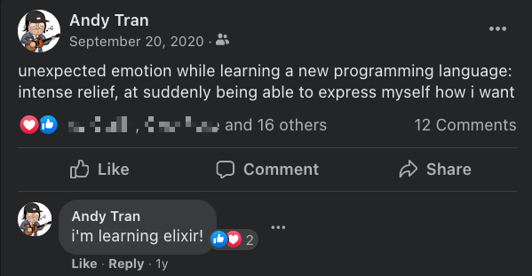
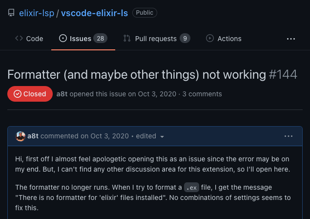
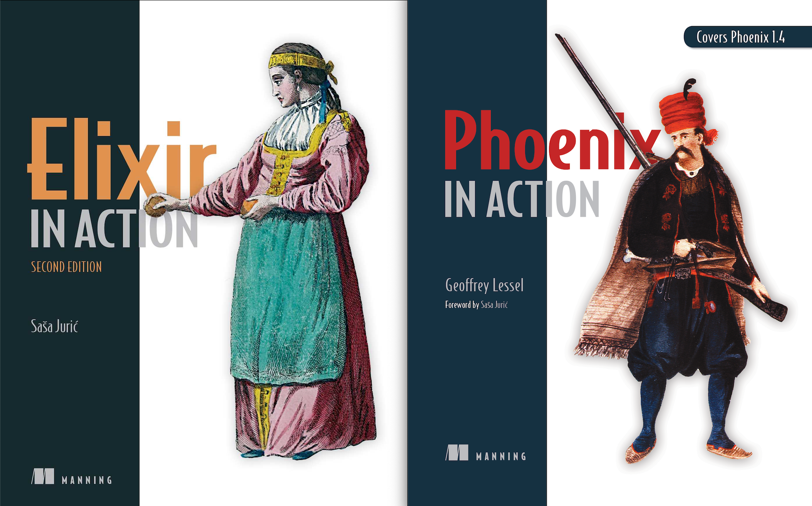
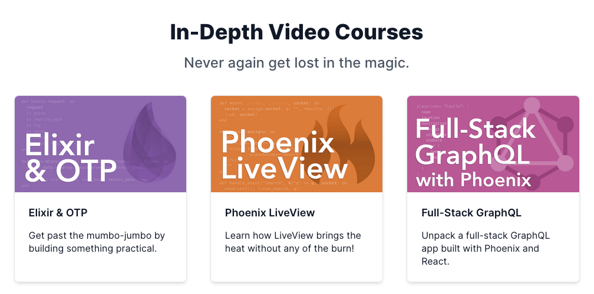
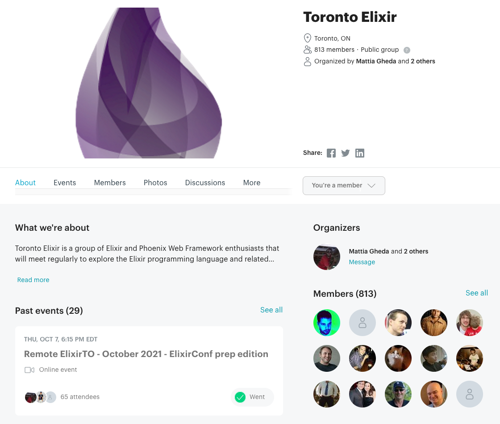

Today, I presented my first programming conference talk at [ElixirConf US 2021](https://2021.elixirconf.com/). My talk was called _The Elixir Community And How To Get Involved_. You can access the slides [here](/2021slides).

As part of that project, I wanted to write a few relevant blog posts. This is the first post of a set of three:

- **How I got involved with the Elixir community** _(this post)_
- How I prepared my ElixirConf 2021 talk _(upcoming)_
- How you can get involved with the Elixir community _(upcoming)_

I prepared a brief story of how I got interested in and involved in Elixir. It's a bit self-indulgent in that it's I did not bother to cut much after I wrote. I'm not sure who will find this interesting or useful, but I'll put it out there anyway.

I don't want this to be considered anything like a prescriptive guide - it's a description of my own unstructured journey.

In terms of method, I am using things like archived emails and my Youtube history to reconstruct this narrative. It's quite easy because I am still in the first chapters of this story. It is still being written.

## In the beginning...

...there was Javascript.

After realizing that I could not (skill, effort) and should not (mental health) continue in the world of physics, I started my journey into programming in 2017. I took a bootcamp that summer. My bootcamp was in Ruby on Rails, which I found I did not enjoy at all. I went down the front end path, in particular preferring React. I found the mental model fit how I wanted to think about software.

I worked at two or three startups in the Toronto area in full stack, mostly front end roles. I became quite familiar with NodeJS and the Javascript ecosystem.

---

I first **heard of** Elixir from [_Why Elixir Matters_](https://www.youtube.com/watch?v=cWAHpvkh8Vs), which I watched in May 2018.

<iframe
  className="mx-auto max-w-full"
  width="560"
  height="315"
  src="https://www.youtube-nocookie.com/embed/cWAHpvkh8Vs"
  title="YouTube video player"
  frameborder="0"
  allow="accelerometer; autoplay; clipboard-write; encrypted-media; gyroscope; picture-in-picture"
  allowfullscreen
></iframe>

I enjoyed the talk. I was into functional programming, but I was focused on learning Haskell and FP in Typescript. I knew that too much mutable state felt wrong, and I knew that side-effects caused headaches. But Elixir didn't seem like the right fit for me at the time - maybe it seemed too similar to Ruby.

I forgot about Elixir for a year.

---

I first **learned how to write** Elixir over a year later, in September 2019. It was for a technical challenge as part of a job interview that I did poorly on. I think it's a testament to the simplicity of the language and the quality of the documentation that I was able to learn it in a week and hack together a Phoenix app, even if the app was poorly structured and poorly written.

I did not get the job. I forgot about Elixir for a year.

---

The next time I came across Elixir, it was another year later for another job interview that I also did poorly on. I did not get the job. But this time, something stuck.

I first **got hooked on** Elixir in October 2020. I re-did the [official language guide](https://elixir-lang.org/getting-started/introduction.html). I realized that the language itself, especially the pipe operator and pattern-matching, fit exactly the way I wanted to express myself. I realized that I felt _relief_.

The day that I installed it, [a bug](https://github.com/elixir-lsp/vscode-elixir-ls/issues/144) was briefly introduced into some tooling. It was fixed less than a day after I opened an issue on Github. This was my first brush with the Elixir community, and I was impressed.

## Content

Over the next few months, I regularly consumed a lot of Elixir content (talks, books, courses, forum, and podcasts) and went to meetups. Some of this was paid content, but I'm not trying to advertise them to you other than saying that I have enjoyed all of them greatly.

### Talks

I started reading blog posts and watching talks. Two of them stick out in my mind from that time. The first is [_Why We've Adopted Elixir_](https://www.youtube.com/watch?v=zL2wcqS78UA). It addressed many of my pain points having used NodeJS to build back ends for almost three years.

<iframe
  className="mx-auto max-w-full"
  width="560"
  height="315"
  src="https://www.youtube-nocookie.com/embed/zL2wcqS78UA"
  title="YouTube video player"
  frameborder="0"
  allow="accelerometer; autoplay; clipboard-write; encrypted-media; gyroscope; picture-in-picture"
  allowfullscreen
></iframe>

The second one is probably well-known to many Elixir developers, and I would cite it as _the_ talk that opened my mind to Elixir's inner workings. It helped me understand more deeply the reasons why Elixir is able to address those pain points mentioned above. It made clear the beauty of the runtime behind the language (which is, in some ways, an interface for the runtime). It was Sasa Juric's [_The Soul of Erlang and Elixir_](https://www.youtube.com/watch?v=JvBT4XBdoUE).

<iframe
  className="mx-auto max-w-full"
  width="560"
  height="315"
  src="https://www.youtube.com/embed/JvBT4XBdoUE"
  title="YouTube video player"
  frameborder="0"
  allow="accelerometer; autoplay; clipboard-write; encrypted-media; gyroscope; picture-in-picture"
  allowfullscreen
></iframe>

### Books

Later, inspired by his talk, I purchased Sasa's _Elixir in Action_ and Geoffrey Lessel's _Phoenix in Action_. These were great deeper dives into the two topics, and I still keep them handy as reference.

I especially enjoy the LiveBook feature on Manning's website, where I have access to the books not only as PDFs but as an whole web experience where I can highlight and take notes on sections.

### Courses and exercises

I toyed around with at using Elixir for what I was familiar with, which is web development. But it wasn't until I purchased and worked my way through the [Pragmatic Studio courses](https://pragmaticstudio.com/) on Elixir and Liveview that it began to click in practice.

I also spent a few months doing the awesome (free) exercises on [Exercism.io](https://exercism.org/tracks/elixir). The mentor / code-review style learning really suited me, compared to LeetCode-style exercises.

### ElixirForum

I made my ElixirForum account in October of 2020, so just under a year before my talk. I lurked for a while before posting my first topic nearly seven months later: [How do you start thinking about the supervision tree?](https://elixirforum.com/t/how-do-you-start-thinking-about-the-supervision-tree/39026).

I check the forum regularly, especially since I saved the forum as a PWA on my phone's home screen.

### Podcasts

I started listening to Elixir podcasts in November 2020, beginning with Elixir Wizards and Thinking Elixir before branching out to Elixir Outlaws and Beam Radio.

I use [Google Podcasts](https://podcasts.google.com) because it includes a dealbreaking feature for me, which is the ability to speed up podcasts. (That's not a criticism of hosts, I just prefer a pace quicker than would be usual for a podcast.)

### Meetups

I started attending the [Toronto Elixir](https://www.meetup.com/TorontoElixir) meetup in [November 2020](https://www.meetup.com/TorontoElixir/events/274307110). I was pretty amazed to see the range of companies just in Toronto who were using Elixir. It was through the Toronto Elixir group that I met Eric, whose referral helped me land by current job using Elixir every day.

## Giving back

The Elixir community is so welcoming and giving that it makes you want to give right back. Briefly (because I'm running out of time to write), I'll talk about how in my short experience with Elixir, I've contributed to open source and spoken at ElixirConf US.

### Open source

I've contributed to two projects:

- [Papercups](https://github.com/papercups-io/papercups), Intercom alternative in Elixir - I implemented a few features relating to SMS and email notifications
- [Phoenix LiveView](https://github.com/phoenixframework/phoenix_live_view), Rich, real-time user experiences with server-rendered HTML in Elixir - I added two utilities that I needed when writing tests for LiveViews

My experiences here were great. I got to write code that is being used by lots of people. I got to interact with really friendly and helpful developers who gave meaningful feedback.

### ElixirConf

In June 2021, I submitted a talk proposal for ElixirConf US 2021. I heard back in August that I was accepted to speak! My next post will detail this further.

# Wrapping up

So there you have it, a year in review of learning and being involved with Elixir. I will likely come back to this post and include more subjective thoughts about these experiences, but I've laid out most of the things that went on.

I did skip a few details, like people who I spoke to along the way who were important, as well as the employment in Elixir that I've been lucky to land. But overall, I hope it was interesting to see how someone getting into Elixir today might do it.
