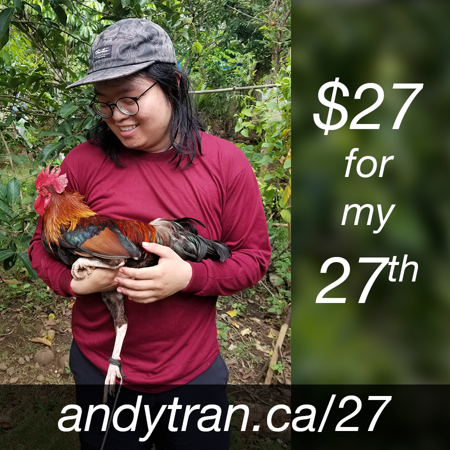

Hey. It's my birthday. I'm fundraising for international observers for the Philippine elections this year. Support the work with just a $27 donation, or hit share if you can't! https://andytran.ca/27

It's my 27th birthday! That means I'm 3³. Fun fact, I used to live on 27 Norfolk in Hamilton and then we moved to 4 Norfolk. That's 3³ -> 2². well, it's fun for me at least.

It's also my 4th ND-versary, which was the day I walked into Migrante Ontario's re-launch in 2018. I've learned a ton about the Philippines since then – about the islands, the people, their history, and their struggle for liberation. It has helped me learn about Vietnam too, our peninsula and people and history and struggle for liberation.

The Filipino people's struggle for national liberation and genuine democracy has been going on for so long. When it emerges victorious, it will change the whole world.

I feel that we need to be there now and in the future as things ramp up, and that's why I support International Coalition for Human Rights in the Philippines and its International Observer Mission (IOM).
The elections in the Philippines are rampant with human rights abuses – arrests, killings, you name it. The IOM is about providing an independent international view on what's happening on the ground. Observers will link with elections watchdogs and people's organizations, so that they can bring back reports on the real situation of the people.

Please consider supporting this work. It means a lot to me!
https://andytran.ca/27

---

one more thing
The pic is a chicken I became acquainted with during my trip to Negros Occidental, Philippines in 2019. Shortly after this pic, I slaughtered and then ate this chicken. DM me if you wanna see the video 😃
